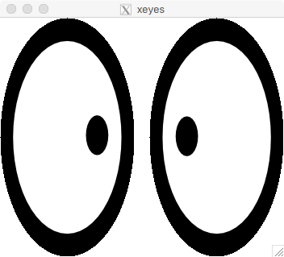

You should have received an account on Blue Waters in advance of this lesson.
In simplest terms, an account on any system means two things: a **username** and a **password**,
and you probably know what both of these are. However, because security is of a primary concern,
Blue Waters uses the so-called **two-factor authentication**. This means that your "password" is,
in fact, made of two components:

   - **PIN**: the part that you control
   - **TOKEN**: 6 (or 8) digits that are generated every 30 seconds either by
     a special hardware RSA token or your mobile device.

So, when you're asked to provide your password (or **PASSCODE**), you have to enter your PIN
followed by a TOKEN.

> ## Set the PIN
> If you have not done so already, you can set you PIN at **<{{ site.otpportal }}>**.
> There, enter your Blue Waters username and press <kbd>Return</kbd>, then enter your token and
> hit <kbd>Return</kbd> again. On the new page you will be asked to specify your **PIN**.
{: .callout}

 
### Connecting to Blue Waters

Unlike regular computers, supercomputers like Blue Waters are designed to be accessed
*remotely* only. To do that, we need a terminal (or a terminal emulator if you are on a Windows
machine). Let's open it up (plese refer to our [Setup](../setup.html) page for more information).
What you see in front of you is called a shell: this is a program that executes other programs.

To connect to Blue Waters we will use a program called **SSH**, which is short for **Secure SHell**.
The general syntax for connecting to any remote machine using `ssh` command is:

~~~
$ ssh -l username remote-machine-address
~~~
{: .language-bash}

Here, `username` is the your username on that remote machine.
 Note, that there is an altenative syntax for the above command:

~~~
$ ssh username@remote-machine-address
~~~
{: .language-bash}

The Blue Waters system's address is **`bw.ncsa.illinois.edu`**. Thus, all we have to do to connect
to Blue Waters is execute the following command:

~~~
$ ssh -l username bw.ncsa.illinois.edu
~~~
{: .language-bash}

    Access by OTP or Two Factor Certificate Authority only.
    Use myproxy-logon -s tfca.ncsa.illinois.edu -p 7512 for gsissh access.
    gsissh or ssh -o PreferredAuthentications=keyboard-interactive for otp access.

    Blue Waters Admin Team

    Enter PASSCODE:
{: .output}

Enter your passcode as we discussed above and hit <kbd>Return</kbd>. You should see a message
similar to the one below:

~~~~~~~~~~~~~~~~~~~~~~~~~~~~~~~~~~~~~~~~~~~~~~~~~~~~~~~~~~~~~~~~~~~~~~~~~~~~~~~~~~
Last login: Fri May 9 10:11:12 2018 from your.computer.address

   ___  __           _      __     __
  / _ )/ /_ _____   | | /| / /__ _/ /____ ___  ___
 / _  / / // / -_)  | |/ |/ / _ `/ __/ -_) __)(_-<
/____/_/\_,_/\__/   |__/|__/\_,_/\__/\__/_/ /___/
~~~~~~~~~~~~~~~~~~~~~~~~~~~~~~~~~~~~~~~~~~~~~~~~~~~~~~~~~~~~~~~~~~~~~~~~~~~~~~~~
Batch and Scheduler configuration.
  Queues:  normal (default), high, low, debug
  Features:  "xe" (default), "xk", "x" (xe or xk non-specific)
             "xehimem" (128GB mem), "xkhimem" (64GB mem)
  30 min default wall time, 48 hr maximum
  -lnodes=X:ppn=Y syntax supported.

All SSH traffic on this system is monitored.

06-10-15 17:57
Blue Waters Discounts Available: For details, see:
https://bluewaters.ncsa.illinois.edu/charge-factor-discounts

Questions?  Mail help+bw@ncsa.illinois.edu to create a support ticket.
For known issues:  https://bluewaters.ncsa.illinois.edu/known-issues
~~~~~~~~~~~~~~~~~~~~~~~~~~~~~~~~~~~~~~~~~~~~~~~~~~~~~~~~~~~~~~~~~~~~~~~~~~~~~~~~~~
{: .output}

**Congratulations!** You have successfully logged in to the Blue Waters supercomputer!

 
### Login nodes: H2O

When we connect to the system, we land on one of the Blue Waters login nodes.
Let's see the name of the computer that we got onto:

~~~
$ hostname -f
~~~
{: .language-bash}
~~~
h2ologin1.ncsa.illinois.edu
~~~
{: .output}

`h2ologin1` above is a name of the login node where we landed. You might've gotten onto
a different login node, such as `h2ologin2` or `h2ologin3`. If, for whatever reason,
you need to connect to a specific login node, you can use its name instead of the generic
**`bw.ncsa.illinois.edu`**, for example:

~~~
$ ssh -l username h2ologin3.ncsa.illinois.edu
~~~
{: .language-bash}

There are only 3 login nodes that are shared by all Blue Waters users. Therefore,
it is important not to run any compute, data, or network-intensive processes on
them.

 
### SSH config

Let us log out from the Blue Waters system for now and have a closer look at the `ssh` command
that we used above.

~~~
$ exit
~~~
{: .language-bash}

The `ssh` command requires a lot of typing: we have to type our username, Blue Waters' address,
then PIN and TOKEN. The chances are, we will make a mistake here or there. To reduce our
chances of making a mistake, let's create a file that will store some of the information
that we enter above. Execute:

~~~
$ mkdir ~/.ssh
$ touch ~/.ssh/config
~~~
{: .language-bash}

Now, let's open that `~/.ssh/config` file in a text editor and enter add the following lines:
~~~
Host bw
    Hostname bw.ncsa.illinois.edu
    User username
~~~
{:. output}

Save and exit from the text editor. Now, let's login to Blue Waters again:

~~~
$ ssh bw
~~~
{: .language-bash}

It should prompt you for your password again. What we've done is we created a (virtual) host `bw`.
From now on, whenever we try to connect to `bw`, we will be, in fact, connecting to
**`bw.ncsa.illinois.edu`**. Moreover, if we don't specify our username, it will use the name we
provided as `User` parameter.

We can log in to Blue Waters with just 7 keystrokes (+password)!

> ## Connecting to specific login nodes
>
> Sometimes it is necessary to connect to a specific login node.
> Change your `~/.ssh/config` file so that you can connect to
> them using a simple `ssh h2ologin1` (and similar) commands
>
> > ## Solution
> >
> > Add the following lines to `~/.ssh/config` file:
> > ~~~
> > Host h2ologin1
> >     Hostname h2ologin1.ncsa.illinois.edu
> >     User username
> > Host h2ologin2
> >     Hostname h2ologin2.ncsa.illinois.edu
> >     User username
> > Host h2ologin3
> >     Hostname h2ologin3.ncsa.illinois.edu
> >     User username
> > ~~~
> {: .solution}
> > ## Solution for recent versions of ssh
> >
> > The above solution works but it is hard not to notice the repetition
> > there: host names are very similar, usernames are identical.
> > Recent versions of `ssh` understand so-called patterns. Using patterns
> > we can rewrite the above solution as:
> > ~~~
> > Host h2ologin?
> >     Hostname %h.ncsa.illinois.edu
> >     User username
> > ~~~
> {: .solution}
{: .challenge}

 
## Working remotely with GUI programs

When we are connected  to Blue Waters _via_ `ssh`, commands that we type in our
terminal are sent to Blue Waters for execution and their output is forwarded
back to our terminal. This procedure works well as long as we are
dealing with the so-called Command-Line Interface (CLI) programs. There is, however, a
different class of programs called Graphical User Interface programs that
require special considerations when working remotely.
Unless you are on Unix, your Terminal (emulator) is a GUI-based program too.
Let's see what happens when we execute a simple GUI program on a login node. Connect to
Blue Waters and execute:

~~~
$ xeyes
~~~
{:. language-bash}
~~~
Error: Can't open display:
~~~
{: .output}

`xeyes` is a simple program that displays a pair of eyes that track movement of
a mouse cursor.  It failed to execute simply because it tried to use a monitor
that does not exist.  The solution is to send (tunnel) display instructions to
a local machine using the so-called X Protocol version 11 (X11). For this
solution to work, your machine must have an **X server** installed and running.
Please refer to our [Setup](../setup.html) page for instructions on how to
install it on your operating system.  This is, clearly, not as efficient as
sending commands to a local monitor but, at least, it allows GUI programs
function properly over `ssh`. To send display instructions to our local machine,
all we have to do is add an extra flag `-X` to the `ssh` command:

~~~
$ ssh -X bw
~~~
{: .language-bash}

Now, execute `xeyes`:
~~~
$ xeyes
~~~
{: .language-bash}

You should see a nice pair of eyes!

Because we used X protocol version 11, what we have just done is called **X11 Forwarding**.
To learn more about X Window System and X11 forwarding, please refer to:
X Window System [wiki page](https://en.wikipedia.org/wiki/X_Window_System),
its manual page (`man X`),
and
a manual page for SSH configuration file (`man ssh_config`).

> ## What if `-X` does not help?
>
> If you get a `Can't open display` error even when using the `-X` flag,
> try the `-Y` flag instead. This flag has the same effect as `-X`, but forwarded
> instructions are not subject to X11 security extension controls
{: .callout}
